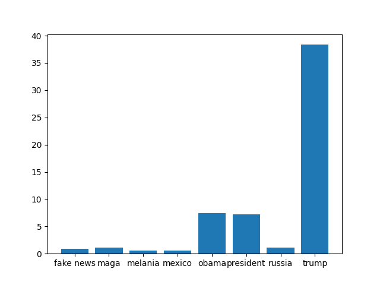
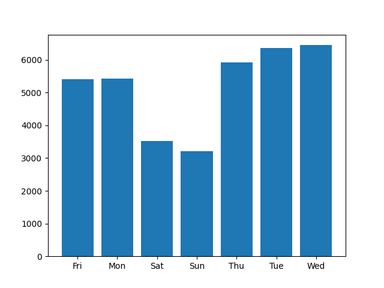

| phrase          | percent of tweets |
|-----------------|-------|
| obama           | 07.47 |
| trump           | 38.35 |
| mexico          | 00.55 |
| russia          | 01.13 |
| fake news       | 00.92 |
| maga            | 01.09 |
| melania         | 00.53 |
| president       | 07.21 |

This table represents the percentage of Donald Trump's tweets posted between 2009 and 2018 that contain the selected phrases.

Here is the data represented on a bar graph:

Analyzing other available data, it seems Trump was most likely to tweet on Wednesday and least likely to tweet on Sunday in 2009-2018:

